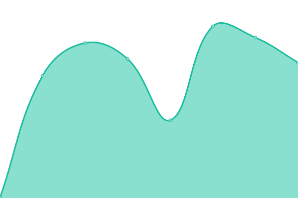
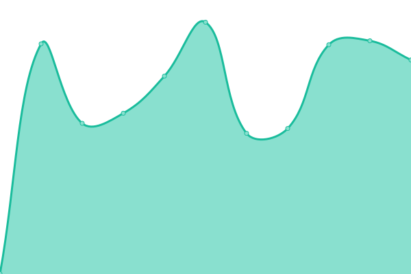

# [📈 Live Status](https://SukiCZ.github.io/DAO-Upptime): <!--live status--> **🟩 All systems operational**

This repository contains the open-source uptime monitor and status page for [Jakub Boukal](suki.wtf), powered by [Upptime](https://github.com/upptime/upptime).

With [Upptime](https://upptime.js.org), you can get your own unlimited and free uptime monitor and status page, powered entirely by a GitHub repository. We use [Issues](https://github.com/SukiCZ/DAO-Upptime/issues) as incident reports, [Actions](https://github.com/SukiCZ/DAO-Upptime/actions) as uptime monitors, and [Pages](https://SukiCZ.github.io/DAO-Upptime) for the status page.

<!--start: status pages-->
<!-- This summary is generated by Upptime (https://github.com/upptime/upptime) -->
<!-- Do not edit this manually, your changes will be overwritten -->
<!-- prettier-ignore -->
| URL | Status | History | Response Time | Uptime |
| --- | ------ | ------- | ------------- | ------ |
|  [Daolabs Landing page](https://daolabs.com) | 🟩 Up | [daolabs-landing-page.yml](https://github.com/SukiCZ/DAO-Upptime/commits/HEAD/history/daolabs-landing-page.yml) | 

 390ms
     
 | 

<a href="https://SukiCZ.github.io/DAO-Upptime/history/daolabs-landing-page">100.00%</a>
    

|  [Daolabs Community](https://community.daolabs.com) | 🟩 Up | [daolabs-community.yml](https://github.com/SukiCZ/DAO-Upptime/commits/HEAD/history/daolabs-community.yml) | 

 388ms
     
 | 

<a href="https://SukiCZ.github.io/DAO-Upptime/history/daolabs-community">100.00%</a>
    

|  [TON Community](https://toncommunityhub.com) | 🟩 Up | [ton-community.yml](https://github.com/SukiCZ/DAO-Upptime/commits/HEAD/history/ton-community.yml) | 

 592ms
     
 | 

<a href="https://SukiCZ.github.io/DAO-Upptime/history/ton-community">100.00%</a>
    

|  [Autonomys Community](https://community.autonomys.xyz) | 🟩 Up | [autonomys-community.yml](https://github.com/SukiCZ/DAO-Upptime/commits/HEAD/history/autonomys-community.yml) | 

 459ms
     
 | 

<a href="https://SukiCZ.github.io/DAO-Upptime/history/autonomys-community">100.00%</a>
    

|  [Sandbox Community](https://daolabs.socialminingjobs.com) | 🟩 Up | [sandbox-community.yml](https://github.com/SukiCZ/DAO-Upptime/commits/HEAD/history/sandbox-community.yml) | 

 570ms
     
 | 

<a href="https://SukiCZ.github.io/DAO-Upptime/history/sandbox-community">100.00%</a>
    

<!--end: status pages-->

[**Visit our status website →**](https://SukiCZ.github.io/DAO-Upptime)

## 📄 License

- Powered by: [Upptime](https://github.com/upptime/upptime)
- Code: [MIT](./LICENSE) © [Anand Chowdhary](https://anandchowdhary.com), supported by [Pabio](https://pabio.com)
- Data in the `./history` directory: [Open Database License](https://opendatacommons.org/licenses/odbl/1-0/)
